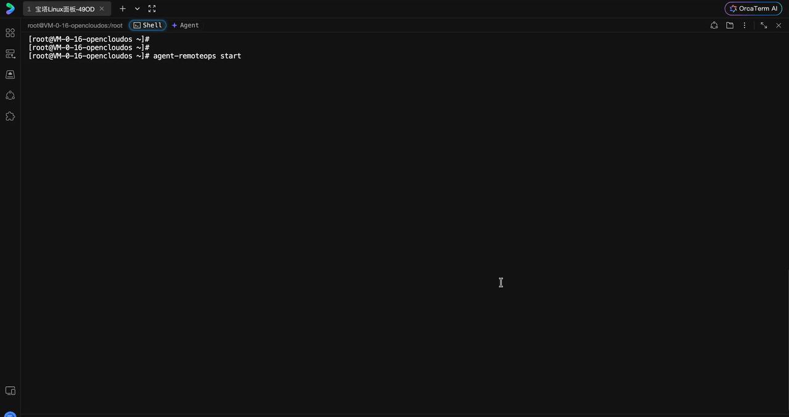

<p align="center">
  
</p>

<h1 align="center">Agent RemoteOps</h1>

<p align="center">English | <a href="./README.zh-CN.md">简体中文</a></p>

<p align="center">Give Codex temporary, controlled access to a remote Linux host for diagnostics and maintenance, with scoped permissions, expiring Sessions, and auditable execution.</p>

> [!WARNING]
> Remote commands executed by an agent are risky. Prefer `readonly`. The `full` mode inherits the permissions of the Linux user that starts the server. Understand the security boundaries below before using it on important systems.

## Why Agent RemoteOps

A local Codex cannot normally inspect the real processes, ports, systemd units, containers, logs, and deployment files on a remote Linux host. Permanent SSH credentials are broader and longer-lived than a temporary diagnostic task requires, while exposing a management port increases the attack surface.

Agent RemoteOps starts an HTTP service bound only to `127.0.0.1` on the remote host and exposes it through a temporary Cloudflare Quick Tunnel. Give the generated URL, Token, and task to Codex. The Session shuts down its HTTP server, Tunnel, Jobs, and tracked child processes on Ctrl+C or TTL expiry.

```text
Local Codex
  `- Agent RemoteOps Skill
       `- bundled Python client
              | HTTPS + Token
              v
       Cloudflare Quick Tunnel
              v
Remote Linux
  `- agent-remoteops CLI
       |- file API
       |- command Jobs
       `- policy, TTL, audit, and process cleanup
```

## Demo

### 1. Start a Session on remote Linux



### 2. Give the Session and task directly to Codex


### 3. Watch the remote console in real time

The remote console shows the Agent's connection, authentication, requests, and command Job logs in real time for execution tracking and auditing.


## Requirements

### Remote Linux

- Linux x64 or arm64
- Node.js 22 or later
- Outbound HTTPS access to npm, GitHub Releases, and Cloudflare

### Local Codex

- Codex with the Agent RemoteOps Skill installed
- macOS or Linux
- Python 3.10 or later
- Network access to the generated `trycloudflare.com` URL

## Installation

### Remote Linux: install the CLI

```bash
npm install -g agent-remoteops
agent-remoteops --version
```

The CLI starts and manages remote Sessions:

| Command                                | Purpose                                  |
| -------------------------------------- | ---------------------------------------- |
| `agent-remoteops start`                | Interactively create a temporary Session |
| `agent-remoteops policy show readonly` | Show the readonly policy summary         |
| `agent-remoteops policy show full`     | Show the full policy summary             |

### Local Codex: install the Skill

Ask Codex to install this GitHub directory:

```text
Install the Agent RemoteOps Skill from:
https://github.com/wwenj/AgentRemoteOps/tree/master/skills/agent-remoteops
```

## Quick start

1. On remote Linux, enter the desired initial directory and run:

   ```bash
   cd /srv/app
   agent-remoteops start
   ```

2. Select the language, lifetime, `readonly` or `full`, initial working directory, and audit setting. Confirm startup and wait for the Session block.
3. Send its URL, Token, and a concrete task to Codex with the Skill installed.
4. Codex submits the Token through the Skill's masked prompt, verifies the authenticated server scope, and performs the task. The user does not run a local connection command.
5. Press Ctrl+C in the remote terminal when finished, or let the TTL expire.

## Permission and security boundaries

| Mode       | File access                                          | Command access                                                              | Intended use                 |
| ---------- | ---------------------------------------------------- | --------------------------------------------------------------------------- | ---------------------------- |
| `readonly` | Reads paths available to the runtime user; no writes | Argument-level allowlist without a shell; validated sequences and pipelines | Default diagnostics          |
| `full`     | Reads and writes paths available to the runtime user | Unrestricted `/bin/bash -lc` commands                                       | Explicitly authorized repair |

- `workingDirectory` is only the relative-path base and initial cwd, not an access boundary.
- `readonly` protects integrity, not confidentiality. It can still read sensitive files available to the runtime user.
- `full` is a server capability, not authorization for a particular mutation.
- The Token is never passed through command arguments or environment variables. It is entered through a masked TTY prompt and stored only in an expiring `0600` temporary state file.
- Quick Tunnel has no SLA and is not suitable for persistent administration or production traffic.
- Normal shutdown cleans tracked processes but cannot roll back persistent side effects or guarantee cleanup after SIGKILL or host failure.

## License

[MIT](./LICENSE)
