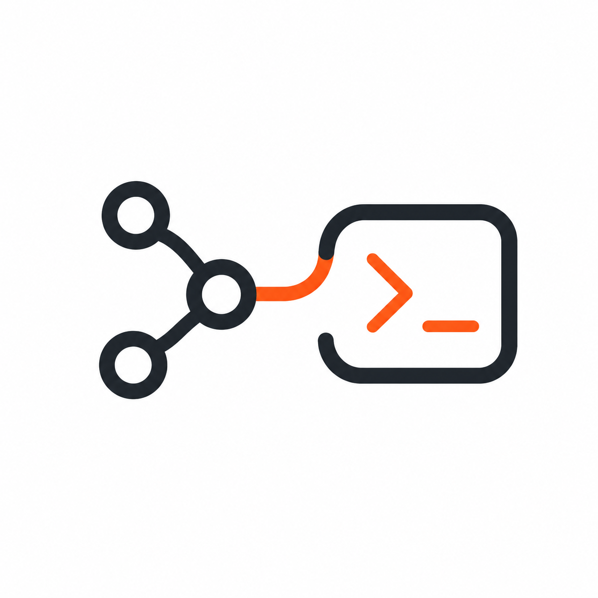

<p align="center">
  
</p>

<h1 align="center">Agent RemoteOps</h1>

<p align="center"><a href="./README.md">English</a> | 简体中文</p>

<p align="center">面向 Coding Agent 的短时、可审计远程运维桥接工具，无需分发长期 SSH 凭证，也不需要暴露常驻管理服务。</p>

> [!WARNING]
> Agent 自动执行命令是危险操作，线上重要服务请谨慎使用。尽量使用 `readonly` 只读模式；`full` 模式在 CLI 层不做限制，并继承启动服务的 Linux 用户权限。在生产主机上使用前，请先了解[权限模式与安全边界](#权限模式与安全边界)。

## 使用演示

完整流程分为三步：在远程主机启动临时 Session，将 URL、Token 和诊断任务交给 Codex，再通过远程控制台实时观察请求与命令日志。

### 1. 启动临时 Session

在远程 Linux 主机运行 `agent-remoteops start`，选择有效期、权限模式和初始工作目录。服务就绪后，控制台会显示临时 URL、Token 和 Session 范围。

<video src="./public/demo-start.mp4" controls muted playsinline width="100%"></video>

[无法播放时直接查看视频](./public/demo-start.mp4)

### 2. 交给 Codex 执行诊断

把 Session 信息和任务发给已安装 Agent RemoteOps Skill 的 Codex。Codex 会先核验真实权限和有效期，再通过受控文件 API 与命令 Job 检查服务器并返回诊断结果。

<video src="./public/demo-codex.mp4" controls muted playsinline width="100%"></video>

[无法播放时直接查看视频](./public/demo-codex.mp4)

### 3. 查看实时控制台日志

Agent 连接、状态核验、HTTP 请求和远程命令会实时显示在服务端控制台，便于观察执行进度并结合本地审计日志追踪操作。

<video src="./public/demo-console.mp4" controls muted playsinline width="100%"></video>

[无法播放时直接查看视频](./public/demo-console.mp4)

## 为什么需要 Agent RemoteOps

Claude Code 或 Codex 这类本地 Agent 只有接触真实运行环境，才能有效检查进程、监听端口、systemd 状态、日志、部署文件和应用健康接口。但生产、测试服务器不应该获取长期连接凭证。虽然 Codex 中已经支持 SSH 远程访问，但多数线上服务由于自身防火墙、未开放端口、内网网络、安全组等原因，很难直接访问。

Agent RemoteOps 为这类任务建立一条临时远程运维通道，无副作用，无心理负担，任务结束后自动关闭。项目聚焦“短时授权、受控执行、过程可审计”，适合补充 SSH 和堡垒机没有覆盖好的 Agent 远程连接诊断场景。

Agent RemoteOps 提供了一种短时替代方案：

1. 在远程主机启动仅监听 `127.0.0.1` 的 HTTP 服务；
2. 通过 Cloudflare Quick Tunnel 建立临时外部访问地址；
3. 所有受保护请求都必须携带随机 Session Token 和已绑定的 Client ID；
4. Session 受 TTL 和 `readonly`/`full` 权限模式约束；
5. Session 到期或主动关闭时，停止 HTTP 服务、Tunnel、Job 和已跟踪的子进程。

```text
本地 Coding Agent
        │  agent-remoteops CLI
        ▼
Cloudflare Quick Tunnel
        │  Token + Client ID
        ▼
仅监听 127.0.0.1 的 RemoteOps 服务
        ├── 结构化文件 API
        └── 经过校验的命令 Job
```

远程主机只需要具备出站 HTTPS 能力。Quick Tunnel 不要求开放入站防火墙端口，不需要 Cloudflare 账号，也不提供固定公网域名。

## 可以做什么

- 无需开放 SSH 或防火墙入站端口，让本地 Codex 临时连接远程 Linux 服务器。
- 快速通过 Codex 等强大 Agent 调试线上服务，排查故障和安全问题。
- 检查服务状态、进程、端口、日志、磁盘、Docker、Git 和应用健康接口。
- 查看和下载远程文件；获得明确授权后，也可以上传文件或执行修改命令。
- 默认使用只读模式，降低 Agent 误操作服务器的风险。
- Session 到期后自动关闭，也可以随时按 `Ctrl+C` 结束；执行过程会显示在远程控制台中。

## 环境要求

### 远程 Linux 主机

- Linux x64 或 arm64
- Node.js 22 及以上版本
- 能够通过 HTTPS 访问 GitHub Releases 和 Cloudflare

### 本地 Codex

- 已安装并可正常使用 Codex
- 能够访问生成的 `trycloudflare.com` 地址

## 安装

### 远程服务器安装 CLI

只需在需要远程诊断的 Linux 服务器上安装 CLI：

```bash
npm install -g agent-remoteops
```

确认安装成功：

```bash
agent-remoteops --version
agent-remoteops --help
```

更新已有安装：

```bash
npm update -g agent-remoteops
```

### 本地 Codex 安装 Skill

在本地 Codex 中发送以下指令，安装项目提供的 Skill：

```text
请从下面的 GitHub 目录安装 Agent RemoteOps Skill：
https://github.com/wwenj/AgentRemoteOps/tree/master/skills/agent-remoteops
```

## 如何使用

在远程 Linux 主机进入需要诊断的目录，运行 `agent-remoteops start` 创建临时 Session，再把控制台显示的 URL、Token 和任务交给已安装 [Agent RemoteOps Skill](https://github.com/wwenj/AgentRemoteOps/tree/master/skills/agent-remoteops) 的 Coding Agent。

启动 Session、交给 Codex 执行任务以及查看控制台日志的完整操作，请参考上方三个演示视频；任务完成后按 `Ctrl+C` 关闭 Session。

## CLI 速查

| 命令                               | 用途                     |
| ---------------------------------- | ------------------------ |
| `start`                            | 启动临时 Session         |
| `connect <url>`                    | 手动连接 Session         |
| `status`                           | 查看权限、目录和到期时间 |
| `exec <command>`                   | 执行远程命令             |
| `list` / `stat` / `read` / `write` | 操作远程文件             |
| `jobs` / `cancel`                  | 查看或取消任务           |
| `disconnect`                       | 删除本地 Session 信息    |

## 权限模式与安全边界

| 模式       | 能力                                                   | 建议                     |
| ---------- | ------------------------------------------------------ | ------------------------ |
| `readonly` | 可读取运行用户有权访问的文件，仅允许白名单内的只读命令 | 默认使用，适合检查与诊断 |
| `full`     | 可读写文件并执行任意 Shell 命令                        | 仅在明确授权时使用       |

- 初始工作目录不是访问边界，两种模式都继承启动服务的 Linux 用户权限。
- `readonly` 防止写入和高风险命令，但不能防止敏感信息被读取。
- `full` 不限制命令内容，请避免使用 `root` 启动。
- URL 和 Token 都是临时敏感凭据；Quick Tunnel 只适合短时任务，不适合作为长期生产入口。

## 许可证

[MIT](./LICENSE)
